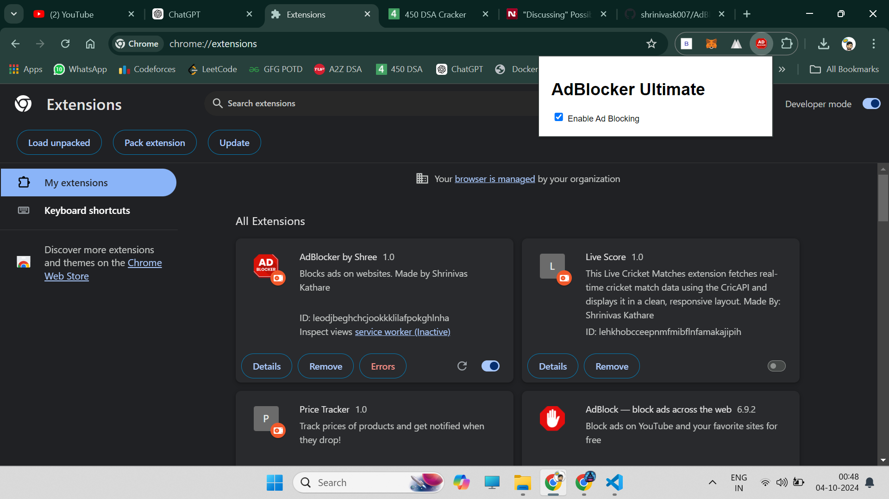

# AdBlocker by Shree

AdBlocker by Shree is a lightweight, highly efficient browser extension that blocks advertisements and tracking scripts on websites. It dynamically loads and applies ad-blocking rules, and supports integration with filter lists like EasyList.



## Features

- Block ads and tracking scripts on websites.
- Easy integration with external filter lists (e.g., EasyList).
- Dynamic rule updating for more flexible ad blocking.
- Simple UI to toggle the ad blocker on and off.

## Installation

1. Clone or download this repository to your local machine:
    ```bash
    git clone https://github.com/shrinivask007/AdBlocker-chrom-extension.git
    ```

2. Open your browser and navigate to the **Extensions** page:
    - For Chrome: Open `chrome://extensions/`
    - For Firefox: Open `about:debugging#/runtime/this-firefox`

3. Enable **Developer Mode** (toggle it on in the top right corner for Chrome).

4. Click on **Load unpacked** (for Chrome) or **Load Temporary Add-on** (for Firefox), and select the folder where you downloaded the project.

5. The extension should now be visible in the extensions bar. Click on the icon to see the popup and control its settings.


## How It Works

### Blocking Ads

The extension blocks ads by listening to network requests using the `chrome.webRequest` or `browser.webRequest` API and intercepting any requests that match known ad URLs or patterns in the filter lists.

### Filter Lists

By default, AdBlocker Ultimate includes a small set of built-in ad filters for common ad-serving domains (e.g., `doubleclick.net`, `adservice.google.com`). You can also load external filter lists dynamically (like EasyList) to extend the ad-blocking capabilities.


### Explanation:

- **Features**: Highlights the key features of the extension.
- **Installation**: Step-by-step guide on how to install the extension in Chrome or Firefox.
- **Structure**: Provides an overview of the folder and file structure.
- **How It Works**: Explains the ad-blocking mechanism and how external filter lists are integrated.
- **Usage**: Shows how to enable/disable the ad blocker and how to add custom filters.
- **License**: Mentions the licensing of the project (you can adjust this section based on the actual license).

This should help users get the extension up and running easily and understand how it works.


